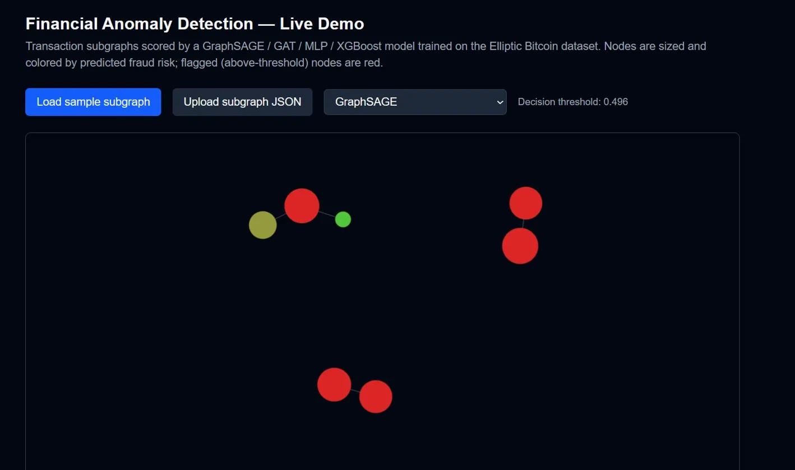
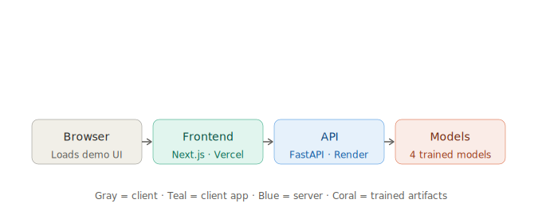

# Financial Anomaly Detection via GraphSAGE

Fraud detection on the [Elliptic Bitcoin dataset](https://www.kaggle.com/datasets/ellipticco/elliptic-data-set), comparing a graph neural network (GraphSAGE, GAT) against non-graph baselines (MLP, XGBoost) on a real, published, graph-native financial anomaly detection benchmark.

**Live demo:** https://financial-anomaly-graphsage.vercel.app
**API docs (Swagger):** https://financial-anomaly-graphsage.onrender.com/docs

> Note: the backend is hosted on Render's free tier and spins down after ~15 minutes of inactivity. The first request after idle time may take 30–60 seconds to wake up — this is expected, not a bug.



---

## Problem

Identifying illicit transactions in a large-scale transaction graph is a classic anomaly detection problem where structure matters: illicit actors often transact with other illicit actors, and that neighborhood information is lost if you treat each transaction as an independent, unconnected data point. This project asks a direct question: **does that graph structure actually help**, compared to a strong non-graph baseline?

## Dataset

[Elliptic Bitcoin dataset](https://www.kaggle.com/datasets/ellipticco/elliptic-data-set) — 203,769 transaction nodes, 234,355 directed edges, 165 anonymized features per node, spanning 49 discrete time steps. Of the labeled nodes, 4,545 are illicit, 42,019 are licit, and the remaining 157,205 are unlabeled.

**Split strategy:** time-based, matching the original Elliptic paper's protocol to avoid leaking future graph structure into training:
- Train: time steps 1–29
- Validation: time steps 30–34
- Test: time steps 35–49

## Results

All four models were trained under identical conditions — same masks, same metrics, same imbalance handling — for a fair apples-to-apples comparison:

| Model | Precision | Recall | F1 | ROC-AUC |
|---|---|---|---|---|
| GraphSAGE | 0.507 | 0.535 | 0.521 | 0.866 |
| GAT | 0.485 | 0.579 | 0.528 | 0.857 |
| MLP | 0.451 | 0.501 | 0.475 | 0.863 |
| **XGBoost** | **0.731** | **0.739** | **0.735** | **0.931** |

### An honest finding

The neural models (GraphSAGE, GAT, MLP) all score dramatically higher on validation F1 (~0.83–0.88) than on the held-out test set (~0.48–0.53). This isn't a bug or a tuning failure — it's a real, documented characteristic of this dataset. There's a known dark-market shutdown event in the Elliptic timeline that falls right around the validation/test boundary, causing a distribution shift in the test period that the neural models struggle to generalize across.

XGBoost — a tree-based model with no access to graph structure at all — handles this shift far better than any of the graph-aware models. This mirrors a finding in the **original Elliptic paper**, which also found Random Forest outperforming GCN on this exact benchmark. Rather than tune away this result, this project reports it as-is: **graph structure alone isn't sufficient to guarantee better generalization under distribution shift**, and a well-tuned non-graph baseline remains a meaningful comparison point, not just a warm-up act before the "real" model.

See `results/` for confusion matrices, ROC curves, and PR curves supporting this comparison.

## Architecture



```
data/raw/elliptic/          Real Elliptic CSVs (not committed, see setup)
src/
  data/                     Elliptic data loading + feature scaling
  models/                   GraphSAGE, GAT, MLP baseline, XGBoost baseline
  train.py                  Config-driven training w/ MLflow logging
  evaluate.py               Generates results/ artifacts
  generate_sample_subgraph.py
api/                        FastAPI inference service (Docker, deployed on Render)
frontend/                   Next.js + react-force-graph-2d UI (deployed on Vercel)
checkpoints/                Trained model weights + fitted scaler (committed)
results/                    Evaluation plots + metrics (committed)
```

**Backend:** FastAPI service exposing `POST /predict/subgraph`, which accepts a set of transaction nodes (raw features) and edges, applies the persisted `StandardScaler`, and returns fraud probabilities from any of the four trained models.

**Frontend:** Next.js app rendering the transaction subgraph as an interactive force-directed graph, colored and sized by predicted fraud risk, with a model selector and the ability to upload a custom subgraph JSON.

## Setup

### Backend

```bash
python -m venv env
env\Scripts\Activate.ps1     # Windows PowerShell
pip install -r requirements.txt
```

Download the Elliptic dataset from Kaggle and place the three CSVs in `data/raw/elliptic/`:

```
data/raw/elliptic/elliptic_txs_features.csv
data/raw/elliptic/elliptic_txs_classes.csv
data/raw/elliptic/elliptic_txs_edgelist.csv
```

Train a model:

```bash
python src/train.py
```

Run the API locally:

```bash
uvicorn main:app --reload --app-dir api
```

### Frontend

```bash
cd frontend
npm install
cp .env.local.example .env.local   # then edit NEXT_PUBLIC_API_URL if needed
npm run dev
```

## Tech stack

PyTorch Geometric · FastAPI · Next.js · react-force-graph-2d · MLflow · XGBoost · Docker · Render · Vercel

## License

MIT

